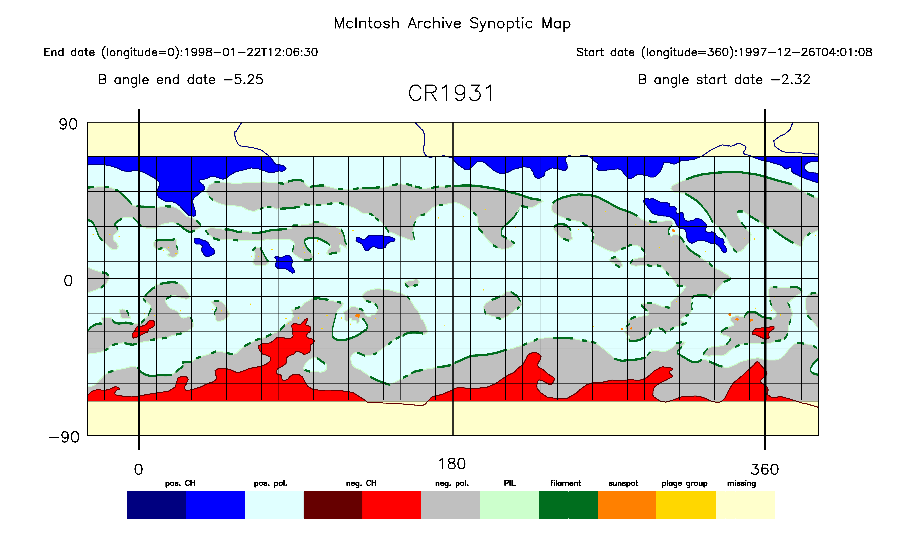

# McIntosh Archive Plot

[](https://travis-ci.com/space-physics/McIntoshArchivePlot)

McA Plotting Software: make plots from Final (Level 3) FITS files for McIntosh synoptic maps for a given Carrington rotation (CROT) number.
Updated code to use standard Astrolib functions and to begin working on GDL (free open-source IDL replacement).



## Prereqs

* [data files](https://www.ngdc.noaa.gov/stp/space-weather/solar-data/solar-imagery/composites/synoptic-maps/mc-intosh/ptmc_level3/ptmc_level3_fits/)
* IDL [Astronomy Library](https://idlastro.gsfc.nasa.gov/) extracted to `~/astrolib`
* tested with IDL 8.2, 8.4 and 8.6.
* [GDL](https://www.scivision.dev/compiling-gdl-gnudatalanguage-on-ubuntu/) &ge; 0.9.7 required if not using IDL (GDL is free open-source) (GDL 0.9.6 does not work, but 0.9.7 does).  
  Note that `doannot=0` argument to `plotfinal` is required for GDL to make the plot.

## Usage

using [1997-12 data file](https://www.ngdc.noaa.gov/stp/space-weather/solar-data/solar-imagery/composites/synoptic-maps/mc-intosh/ptmc_level3/ptmc_level3_fits/ptmc_compo_sm_19971226_040108_cr1931_l3.fits.gz)

from IDL/GDL:

    !PATH=!PATH+':utils/'+':'+Expand_Path('+~/astrolib/pro')

    plotfinal, dirname="data"

The first line may be added to your IDLDE Path if you don't want to type that each time, under Preferences -> IDL -> Paths.

or, from the command line (assuming the Paths are set in IDL already). 
This writes a GIF of the plot.

```sh
idl -e plotfinal, dirname="data"
```

### Colormap

    patmapcolortable,r,g,b


## Programs


### plotfinal.pro

<https://www2.hao.ucar.edu/mcintosh-archive/plotfinalpro>

This program utilizes FITS header to define latitude and longitude
coordinates to create custimized images. Keywords:

CROT: Carrington rotation number Default=1931

DIRNAME: directory name if fits file not in local directory
Default=unset

SCALECROP: scaled pixel size (degrees) can be used to decrease resolution of plots (not advised) 
Default=0.09

DODISPLAY: whether to display on screen or just make gifs/jpegs 
0: no display 
1: display 
Default=1

DOGRID: whether to plot a grid 
0: no grid 
1: grid 
Default=1

DOANNOT: whether to plot annotations 
0: no annotations 
1: minimal annotations 
2: full annotations Default=2

HIGHLAT: what to do above/below 70 degrees highlat 
0: will plot all data at all latitudes highlat 
1: will plot everything at high latitudes as yellow EXCEPT coronal holes

highlat 
2: will plot everything at high latitudes as yellow EXCEPT coronal hole boundaries highlat 
3: will plot everything at high
latitudes as yellow 
Default=2

PLOTEXT: whether or not to plot the +/- 30 degrees extension to maps 
0: no extension 
1: extension 
Default=1

CHOICE: color table choice (see patmapcolortable.pro for choices)
Default=1

CHARSIZE: character size scaled to inverse of resolution
Default=1/scalecrop

CHARTHICK: character size scaled to inverse of resolution
Default=.75/scalecrop

FATFIL: increase thickness of filaments degrees thick Default=.5

FATSUN: increase thickness of sunspot degrees thick Default=0 (no
thickening)

JPEG: save a jpeg as well as a gif Only set up for GRIDANNOT plots
Default=0 (no)

CHOICE: color table choice Default=1 (unless POLSUN set, then 3)

POLSUN: whether to distinguish negative/positive polarity if set, will
plot negative polarity sunspots as rose-colored, positive as orange
Default=0 (all sunspots will be orange)

### patmapcolortable.pro

**Outputs:**

`r, g, b`
(red, green, blue byte arrays of 256 color values used in gif images) 


**Keywords:**

`choice`: which color table to use

Options: 
* Original color table = 0 
* Custom table = 1 
* Custom table = 2 

Default = 0 (note if called by plotfinal this will be overwritten with 1)

choice = 0 1st color is white 
= 0 2nd color is black 
= 1 3rd color is navy
for positive CH boundary 4th color is blue for positive CH 5th color is
light cyan for positive polarity 6th color is magenta for negative CH
boundary 7th color is red for negative CH 8th color is silver for
negative polarity 9th color is dark green for polarity inversion line
(PIL) 10th color is bright green for filaments (i.e., for solid PILs,
which include filaments) 11th orange for sunspots (tend to be larger
sunspots since they are obtained from Ha images) 12th color is yellow
for missing data 13th color is the tangerine border 14th color is the
gold 8-pixel plage centers of changing flux outside active regions All
of the rest should be black = 0,0,0

choice=1* (this is default for plotfinal) 1st color is white 
= 0 2nd color is black 
= 1 3rd color is navy 
for positive CH boundary 4th color
is blue for positive CH 5th color is light cyan for positive polarity
6th color is dark plum for negative CH boundary 7th color is (paler) red
for negative CH 8th color is silver for negative polarity 9th color is
pale green for polarity inversion line (PIL) 10th color is dark green
for filaments (i.e., for solid PILs, which include filaments) 11th
orange for sunspots (tend to be larger sunspots since they are obtained
from Ha images) 12th color is pale yellow for missing data 13th color is
the black border 14th color is the gold 8-pixel plage centers of
changing flux outside active regions All of the rest should be black =
0,0,0

choice=2 1st color is white 
= 0 2nd color is black 
= 1 3rd color is navy
for positive CH boundary 4th color is blue for positive CH 5th color is
light cyan for positive polarity 6th color is dark plum for negative CH
boundary 7th color is (paler) red for negative CH 8th color is silver
for negative polarity 9th color is pink for polarity inversion line
(PIL) 10th color is light plum for filaments (i.e., for solid PILs,
which include filaments) 11th orange for sunspots (tend to be larger
sunspots since they are obtained from Ha images) 12th color is pale
yellow for missing data 13th color is the tangerine border 14th color is
the gold 8-pixel plage centers of changing flux outside active regions
All of the rest should be black = 0,0,0

choice=3 same as choice = 1, but with addition of rose as 15th color,
representing negative polarity sunspots McIntosh Archive of Synoptic Maps

## Notes

- original [code](https://www2.hao.ucar.edu/mcintosh-archive/plotting-software)
- McIntosh Archive Project [article](https://eos.org/research-spotlights/preserving-a-45-year-record-of-sunspots?utm_source=eos&utm_medium=email&utm_campaign=EosBuzz011918)
